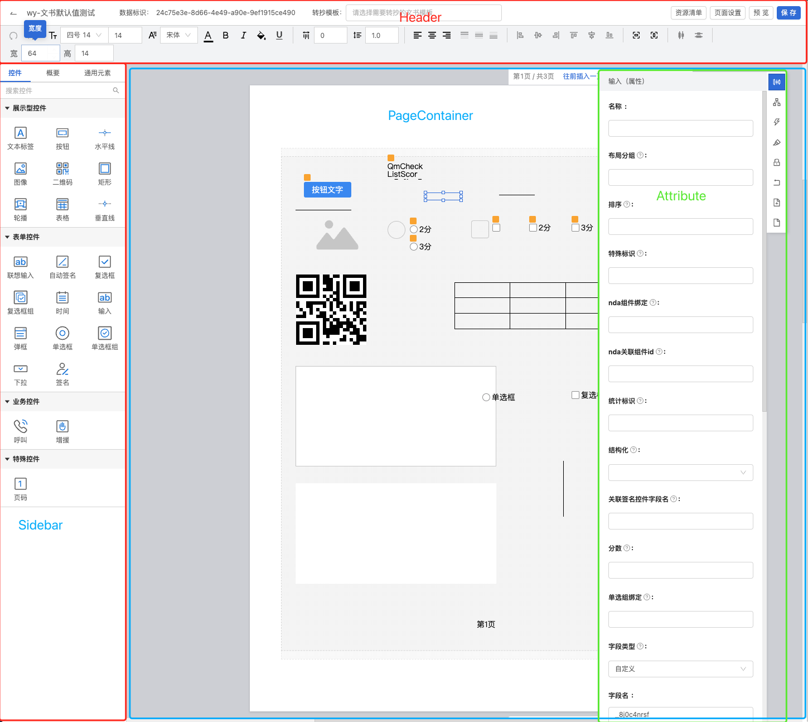

## 开发调试

### 环境参考
- node: v16.20.2
- yarn: 1.22.22
macos 13.0.1

在根目录下执行`yarn`安装依赖

### editor


#### 修改代理

在```packages/lina-editor/.umirc.js```中，修改```proxy```代理地址

#### 启动服务

```yarn editor```

#### 访问对应环境文书

假设代理到```http://10.2.3.170:86```，那么就去*配置中心-模板管理-Lina模板*中找一个模板，比如```http://10.2.3.170:86/lina/?id=6673da1ce334e42bf7a4623d&workflow=65095ed2cf1fe2309d01015e&structTypeId=nurse```

复制路径+参数，访问即可
```http://localhost:8000/lina/?id=6673da1ce334e42bf7a4623d&workflow=65095ed2cf1fe2309d01015e&structTypeId=nurse```

注意，需要先在该环境登录一下，保留token，不然会报错。

## 架构

### editor

页面结构

