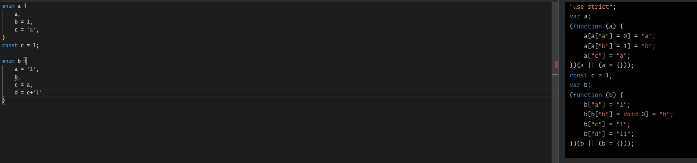
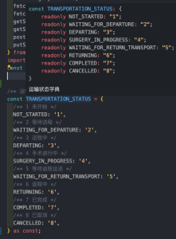

# 不常用知识点

## 泛型

泛型即为类型参数化，可以理解为一个占位符，用来表示类型。

### 基本用法

泛型可以用在函数、类、接口等地方，用来表示类型参数。

比如变量声明空间：
```typescript
// 箭头函数
const identity: <T = string>(arg: T) => T = (arg) => {
    return arg;
};

// interface形式写法
const identity2: { <Type = number>(arg: Type): Type } = identity;

// 具名函数
function identity3<T = 1>(arg: T): T {
    return arg;
};
```

比如类型声明空间：
```typescript
// 在调用函数时指定泛型参数 const b: Identity2 = (a) => a;
interface Identity {
    <T>(arg: T): T;
}

// 在定义函数时指定泛型参数 const a: Identity<number> = (a) => a;
interface Identity2<T> {
    (arg: T): T;
}

// 在调用函数时指定泛型参数 const b: Identity2 = (a) => a;
type Identity3 = <T>(arg: T) => T;

// 在定义函数时指定泛型参数 const a: Identity<number> = (a) => a;
type Identity4<T> = (arg: T) => T;

```

### 泛型约束

泛型约束可以用来约束泛型的类型，比如只允许传入包含length属性的类型。

```typescript
interface Lengthwise {
    length: number;
}

type Identity = <T extends Lengthwise>(arg: T) => T;

const identity: Identity = (arg) => {
    console.log(arg.length);
    return arg;
};
```

```extends```关键字除了继承，还可以用来约束泛型的类型，```A extends B```代表着A要能满足B的类型。


什么时候才会需要用到泛型：各个类型之间有联系

## 条件类型

```typescript

type I = number extends string ? true : false; // false

type II = (never | string) extends string ? true : false; // true

type III = string extends (number | string) ? true : false; // true

```

### 条件类型推断

条件类型中有一个关键字是```infer```，它可以帮助我们推断出一个类型，用来在之后使用。

```typescript
type I<T> = T extends Array<infer Item> ? Item : T;
```

比如内置映射类型```ReturnType```，它可以帮助我们推断出函数的返回值类型。

```typescript
type ReturnType<T> = T extends (...args: any[]) => infer R ? R : any;
```

### 分布式条件类型

如果条件类型是泛型，而且泛型是联合类型，那么就会分开应用。

示例：

```typescript
type A = 'x' | 'y' extends 'x' ? 1 : 2; // 2

type P<T> = T extends 'x' ? 1 : 2;
type A2 = P<'x' | 'y'>; // 1 | 2

type P2<T> = [T] extends ['x'] ? 1 : 2;
type A3 = P2<'x' | 'y'>; // 2
```

这是为了使下面这种写法能够成立：

```typescript
type P<T> = T extends string ? T : never;
type A2 = P<'x' | 'y' | 3>;
```

所以条件类型也可以用来做过滤，比如过滤掉联合类型中的某个类型。

它在类型体操中非常常用。

如果不希望被分布，可以使用[]来包裹使其成为元祖类型。

```typescript
type P<T> = [T] extends [string] ? T : never;
type A2 = P<'x' | 'y'>;
```


## 枚举



 **紧跟在计算成员后的枚举成员必须有初始值；**

**成员必须是常量，可以是计算属性；**

**数字成员会生成双向属性；**

**当const断言的对象足够使用时，不需要使用枚举；**



const assertions 是 TypeScript 3.4 中引入的一种新语法，它可以让 TypeScript 将一个变量的值推断为一个更具体的类型。


## 映射类型

映射类型是一种特殊的类型，它可以根据一个已知的类型生成一个新的类型。

```typescript
type I = {
  [key: string]: boolean | MyInterface;
};
 
const conforms: I = {
  del: true,
  rodney: false,
};
```

映射类型建立在索引签名语法上，用来声明未提前声明的属性的类型。

### 映射修饰符

映射类型在使用泛型时很好用，比如它可以用来将一个类型的所有属性变为只读。

修饰符readonly和?可以用来修饰映射类型中的属性，分别代表只读和可选。

```typescript
type CreateMutable<Type> = {
  readonly [Property in keyof Type]: Type[Property];
};

type CreateMutable<Type> = {
  [Property in keyof Type]?: Type[Property];
};
```

修饰符+、-可以用来移除或者添加这两个修饰符，如果不指定，默认为+。

```typescript
type Concrete<Type> = {
  [Property in keyof Type]-?: Type[Property];
};
```

in关键字用来遍历联合类型，相当于给后面的联合类型用了```map```函数。

in在这里不仅可以映射 ```string | number | symbol```，它可以映射任何类型，下面在```as```关键字中会讲到。


### 映射类型中的as

映射类型中，可以使用as来指定一个类型，用来覆盖原有的类型。

```typescript
// 使用模板字符串来生成新的属性名
type Getters<Type> = {
    [Property in keyof Type as `get${Capitalize<string & Property>}`]: () => Type[Property]
};
```

如果```in```是```map```函数中的```item```，那么```as```后面跟着的可以理解为```map```的```return```。

```typescript
type EventConfig<Events extends { kind: string }> = {
    [E in Events as E["kind"]]: (event: E) => void;
}
 
type SquareEvent = { kind: "square", x: number, y: number };
type CircleEvent = { kind: "circle", radius: number };
 
type Config = EventConfig<SquareEvent | CircleEvent>;
//type Config = {
//     square: (event: SquareEvent) => void;
//     circle: (event: CircleEvent) => void;
// }
```

上面的映射意思为，对于```Events```联合类型的每一个成员，，将```E["kind"]```作为新的属性名，对应的值为(event: E) => void。

in关键字也可以映射联合类型

```typescript
type EventConfig<Events extends { kind: string }> = {
    [E in Events as E["kind"]]: (event: E) => void;
}
 
type SquareEvent = { kind: "square", x: number, y: number };
type CircleEvent = { kind: "circle", radius: number };
 
type Config = EventConfig<SquareEvent | CircleEvent>
//type Config = {
//    square: (event: SquareEvent) => void;
//    circle: (event: CircleEvent) => void;
//}
```

## 对象字面量的惰性初始化

下面这种写法肯定很常见：

```javascript
const a = {}

a.b = 1
a.c = 'c'
```

在TS中，这样是非法的。

TS是强类型语言，```a```的类型在初始化的时候就已经确定下来了，所以不能再添加新的属性。

解决方案有很多，比如用**类型断言**：

```typescript
const a = {} as any;

a.b = 1;
a.c = 'c';
```

显然any不太好，因为这样就失去了TS的类型检查。

我们可以使用interface来固定类型，又能实现惰性初始化：

```typescript
interface A = {b: number; c: string;};

const a = {} as A;
a.b = 1;
a.c = 'c';
```

## 交叉类型

```typescript
interface A  {a: 1, b: 2};
interface B  {a: 1, c: 4};

type C = A & B;

const c: C = {a: 1, b: 2, c: 4}; // ok
```

交叉类型不能相斥：

```typescript
interface A  {a: 1, b: 2};
interface B  {b: 3, c: 4};

type C = A & B; // never

const c: C = {a: 1, b: 2, c: 4}; // error

```

所以交叉类型使用必须非常注意，尤其是作为泛型使用。

一个经典去重体操：
```typescript
type A<T, U> = Exclude<T | U, T & U>;
type B = A<1 | 2, 1 | 3>; // 1 | 3
```

---
如果有任何疑问或错误，欢迎留言进行提问或给予修正意见。

如果喜欢或对你有所帮助，欢迎Star[我的博客](https://github.com/wy2016xiao/blog)，对作者是一种鼓励和推进。

也欢迎关注[我的掘金](https://juejin.im/user/583bbd74ac502e006ea81f99)，浏览更多优质文章。