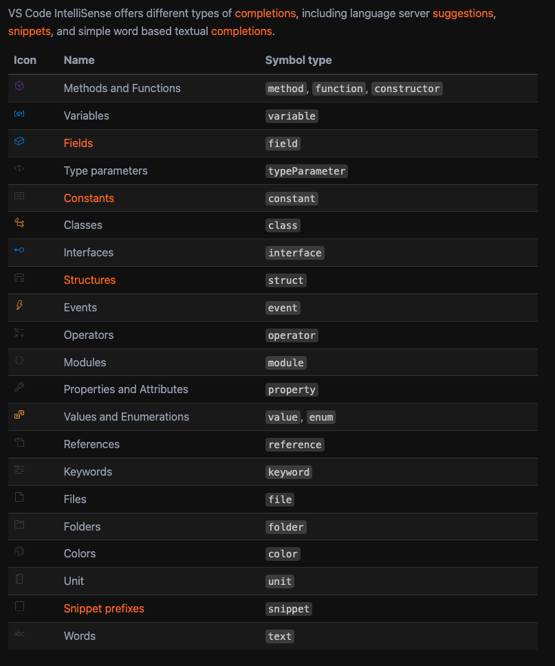

## 开发体验优化

### 设置优化
```json
{
	"typescript.updateImportsOnFileMove.enabled": "always", // 移动或重命名ts文件时，是否自动更新文件中的导入路径
}
```

### 注释提示

#### 顶层提示

鼠标hover


intelliSense


#### 属性提示


#### vscode intellisense icon



#### 弃用


## meepo中的DTS文件

ts默认不会读取.开头以及node_modules下的文件夹，所以.meepo会被忽略，内部的.d.ts不会被外部找到，不大行，要改tsconfig


善用声明合并，可以对meepo中的类型定义进行扩展


## 代码片段

### 代码片段类型

#### 静态代码片段

通过单个命令进行的简单的文本复制和粘贴

#### 动态代码片段

定制的逻辑链路。包括：

* Tab Stops：按顺序编号的tab键跳转的位置

* Mirrored Tab Stops：镜像tab跳转位置，可以同时在多个地方输入相同的内容

* Placeholders：默认值，可以通过下拉列表选择他们

* Variables：变量，可以在代码片段中使用，选中的文字、系统日期、剪贴板内容等

#### 宏代码片段

可以使用正则甚至脚本改变原有的代码

### 代码片段语法

#### 制表符

tab stops由```$```和序号组成，比如```$1``` ```$2```等。

```$0```表示退出代码片段，以及最后光标停留的位置。

就像这样：

```json
{
    "Insert div": {
        prefix: "div",
        body: ["<div>","$1","</div>", "$0"]
    }
}
```

#### 镜像制表位

镜像制表位由相同的```${N}```组成，只要是同序号的地方，都会镜像同步。

```json
{
    "Insert div": {
        prefix: "div",
        body: ["<div>","$1","</div>", "$0", "$1"]
    }
}
```

#### 占位符

占位符一般被大括号包裹，可以设置默认值，也可以嵌套。

```json
{
    "tttttt": {
		"prefix": "ttt",
		"body": ["11${1:first ${2:second}}22"]
	}
}
```

上面这个代码片段，输出后会是```11first second22```，光标会先停留在```first second```上，按tab之后再停留在```second```上。

#### 选择

选择由```|```包裹，逗号分隔，可以在选择之间切换。

```json
{
  "Insert task list": {
    "prefix": "task",
    "body": ["- [${1| ,x|}] ${2:text}", "${0}"]
  }
}
```

#### 变量

vscode也提供了许多变量可以使用，像```$TM_SELECTED_TEXT``` ```$CLIPBOARD``` ```$CURRENT_YEAR```等。

```json
{
  "Insert log": {
    "prefix": "log",
    "body": [
      "console.log('$TM_SELECTED_TEXT', $TM_SELECTED_TEXT);",
      "$0"
    ]
  }
}
```

变量也可以给默认值，比如```${TM_SELECTED_TEXT:default}```。

[更多的字段可以查看官方文档](https://code.visualstudio.com/docs/editor/userdefinedsnippets)

#### 变换

变换是对变量的处理，比如大小写转换、正则匹配等。可以处理默认值，也可以处理变量。

它的语法是```${«variable or placeholder»/«regex»/«replacement string»/«flags»}```

regex：正则表达式

regplacement string：用来替换匹配到的内容字符串

flags：正则的标记，g：全局搜索 i:大小写敏感 m:多行搜索 s:允许.匹配新行的字符

```json
"Uppercase first tab stop": {
  "prefix": "up",
  "body": ["${TM_SELECTED_TEXT/.*/${0:/upcase}/}"]
}
```

### 代码片段快捷键

#### 注册代码片段

在user_snippet文件中注册代码片段

```json
{
    "jsdoc_block_comment": {
        "prefix": "doccccccccc",
        "body": [
            "/**",
            " * ${TM_SELECTED_TEXT}$1",
            " */"
        ],
        "description": "js block doc"
    },
    "jsdoc_inline_comment": {
        "body": [
            "/** ${TM_SELECTED_TEXT}$1 */",
        ],
        "description": "js inline doc"
    }
}
```

#### 绑定快捷键

打开快捷键JSON文件，ctrl+shift+p，输入shortcuts，选择打开快捷键文件


添加自定义快捷键，name要对应代码片段中的key。


## 开发技巧

### 对象字面量的惰性初始化

下面这种写法肯定很常见：

```javascript 
const a = {}

a.b = 1
a.c = 'c'
```

虽然在js中可以这样写，但在TS中，这样是非法的。

TS是强类型语言，```a```的类型在初始化的时候就已经确定下来了，无论内部有什么成员，都不能再添加新的属性。

但习惯js编程思想的我们，肯定想要这样灵活的写代码。

解决方案也有很多，比如用**类型断言**：

```typescript
const a = {} as any;

a.b = 1;
a.c = 'c';
```

显然any不太好，因为这样就失去了TS的类型检查，而且开发不友好，代码提示始终是```any```。

我们可以使用interface来固定类型，又能实现惰性初始化：

```typescript
interface A {b: number; c: string;};

const a = {} as A;
a.b = 1;
a.c = 'c';
```

### 全局类型定义

我们通常会有一些全局范围内使用的变量，会给它定义全局类型，这样可以不用哪儿哪儿都```import```引入类型，就能直接使用。

通常情况下我们可以声明```.d.ts```文件，当ts编译器遇到这个文件时，会自动识别为全局类型定义。

但这有一个前提条件，就是文件中不允许出现```import``` ```export```等关键字，否则会被识别为模块。

但往往我们希望定义的全局文件也能通过```import```的方式引入，并暴露给全局。

当我们使用```import```显式地将文件转为模块之后，类型声明需要改变一下。

```typescript
declare global {
  interface IMyinterface {
    a: number;
  }
}
```

这样就可以在全局范围内使用```IMyinterface```了。

对于扩展已存在的定义，比如```eventListener```，可以这样

```typescript
export const DOCUMENT_EVENT_MAP = {
    /** 取消多组件框选 */
    DISMISS_ACTIVE_GROUP: 'dismissActiveGroup',
    CLEAR_EDITING: 'clearEditing'
} as const;


type DocumentEventExtends = {
    [K in keyof typeof DOCUMENT_EVENT_MAP]: (a: string) => {};
}

// 声明全局的 DocumentEventMap 接口扩展
declare global {
    interface DocumentEventMap extends DocumentEventExtends {}
}
```

### nvm自动切换node版本

在项目根目录下创建一个```.nvmrc```文件，内容为node版本号，比如```14.17.0```。

这样，在```nvm use``` ```nvm install```没有指定版本号的时候，默认会使用这个版本。

同时再在.zshrc文件中加上一段脚本，可以在zsh切换到对应路径时，自动切换node版本。

```shell
# 进入目录自动读取.nvmrc文件并切换到指定的node版本，赛高！
autoload -U add-zsh-hook
load-nvmrc() {
  local node_version="$(nvm version)"
  local nvmrc_path="$(nvm_find_nvmrc)"

  if [ -n "$nvmrc_path" ]; then
    local nvmrc_node_version=$(nvm version "$(cat "${nvmrc_path}")")

    if [ "$nvmrc_node_version" = "N/A" ]; then
      nvm install
    elif [ "$nvmrc_node_version" != "$node_version" ]; then
      nvm use
    fi
  elif [ "$node_version" != "$(nvm version default)" ]; then
    echo "Reverting to nvm default version"
    nvm use default
  fi
}
add-zsh-hook chpwd load-nvmrc
load-nvmrc
```


---
如果有任何疑问或错误，欢迎留言进行提问或给予修正意见。

如果喜欢或对你有所帮助，欢迎Star[我的博客](https://github.com/wy2016xiao/blog)，对作者是一种鼓励和推进。

也欢迎关注[我的掘金](https://juejin.im/user/583bbd74ac502e006ea81f99)，浏览更多优质文章。