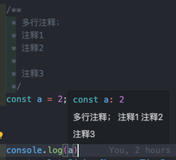
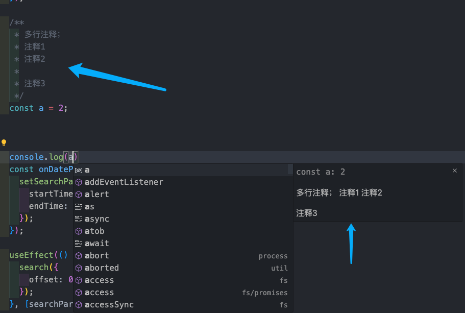
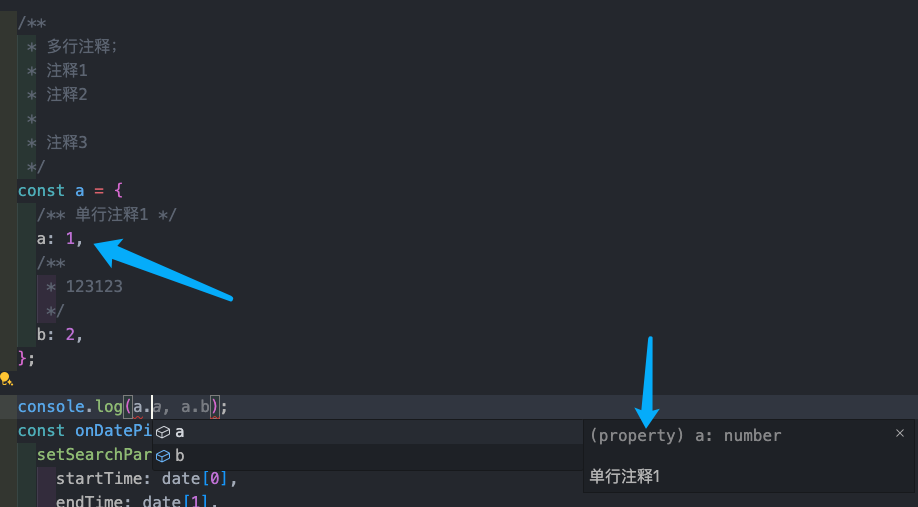
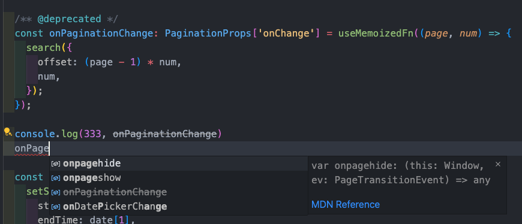
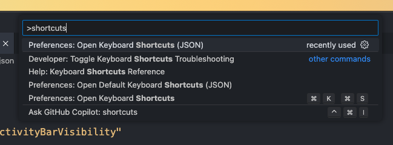
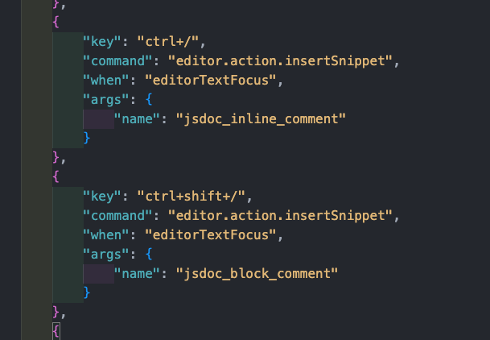
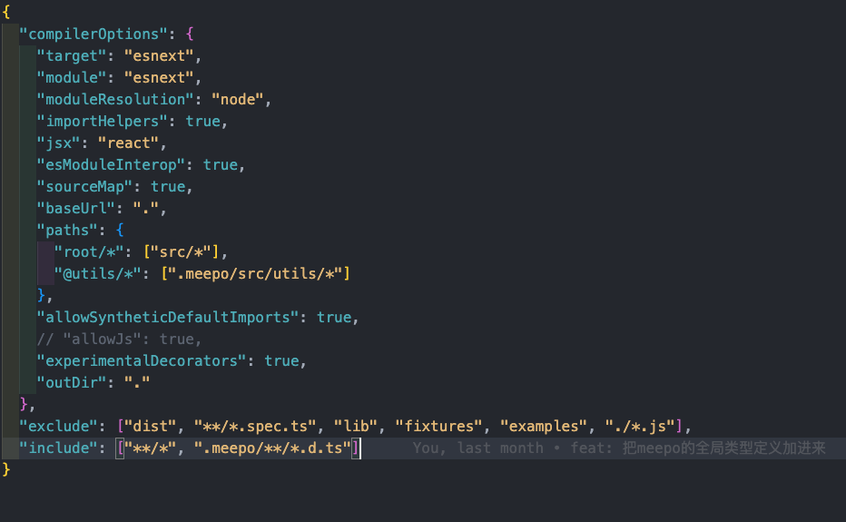

## before

先推荐两个学习途径：

[TypeScript手册](https://ts.nodejs.cn/docs/handbook/intro.html)

[《深入理解TypeScript》](https://jkchao.github.io/typescript-book-chinese/)

## 配置文件说明

以手术闭环项目为例，讲解配置文件的内容，可以快速熟悉ts相关配置：

```json
{
  "compilerOptions": {
    "target": "esnext",
    "module": "esnext",
    "moduleResolution": "node",
    "importHelpers": true,
    "jsx": "react",
    "esModuleInterop": true,
    "sourceMap": true,
    "baseUrl": ".",
    "paths": {
      "root/*": ["src/*"],
      "@utils/*": [".meepo/src/utils/*"]
    },
    "allowSyntheticDefaultImports": true,
    // "allowJs": true,
    "experimentalDecorators": true,
    "outDir": "."
  },
  "exclude": ["dist", "**/*.spec.ts", "lib", "fixtures", "examples", "./*.js"],
  "include": ["**/*", ".meepo/**/*.d.ts"]
}
```

### target

设定编译目标版本

#### 默认值
ES3

#### 示例
es3 es5 es6 es2015 es2016 esnext

### module

指定生成的js代码使用哪个模块系统

#### 默认值

如果target是es3或者es5则为commonjs;

否则为es6

#### 示例

none commonjs amd umd system es6 es2020 esnext node16 nodenext

### moduleResolution

指定ts编译器的模块解析策略

#### 默认值

如果module字段为AMD、UMD、System、es6，则为Classic;

如果module字段为node16或者nodenext，则为node

#### 示例

classic node16 node10/node nodenext bundler

### importHelpers

是否引入降级操作。比如展开操作符、async关键字、extend关键字等。

### jsx

控制如何处理jsx代码。

#### 示例

preserve - 保留jsx代码，生成jsx文件

react-native - 保留jsx代码，生成js文件

react - jsx转译成React.createElement，生成js文件

react-jsx - jsx转译成_jsx函数调用，生成js文件

### esModuleInterop

是否使用es module来导入CommonJS模块。

默认值为false，在遇到CommonJS模块时，不能使用import a from 'a'的语法，要使用import * as a from 'a'的语法。

### sourceMap

是否生成sourceMap文件

### baseUrl

指定模块路径的基础路径。

比如：baseUrl: './src'。那么在import {a} from "utils"将会被视为src/utils。

### paths

指定路径别名，它相对于baseUrl。

allowSyntheticDefaultImports

如果设置为true，即使模块没有export default，也可以写import a from 'a'，不用硬写import * as a from 'a'。

### allowJs

控制ts编译器是否处理js文件。

一般情况下都不需要配置为true，因为我们使用了babel等编译器。

### experimentalDecorators

允许使用装饰器

### outDir

指定编译后的js输出位置

### types

控制允许全局使用的类型定义

更多可以看文档：[TSConfig Reference](https://ts.nodejs.cn/tsconfig#references)

## 开发体验优化

### 设置优化
```json
{
	"typescript.updateImportsOnFileMove.enabled": "always", // 移动或重命名ts文件时，是否自动更新文件中的导入路径
}
```

### 注释提示

#### 顶层提示

鼠标hover



sugesstion



#### 属性提示



#### 弃用



### 代码片段快捷键

[代码片段入门指南](https://www.freecodecamp.org/chinese/news/definitive-guide-to-snippets-visual-studio-code/)

建议直接放到user_snippet的文件中方便查看

#### 注册代码片段

在user_snippet文件中注册代码片段

```json
{
    "jsdoc_block_comment": {
        "prefix": "doccccccccc",
        "body": [
            "/**",
            " * ${TM_SELECTED_TEXT}$1",
            " */"
        ],
        "description": "js block doc"
    },
    "jsdoc_inline_comment": {
        "body": [
            "/** ${TM_SELECTED_TEXT}$1 */",
        ],
        "description": "js inline doc"
    }
}
```

#### 绑定快捷键

打开快捷键JSON文件，ctrl+shift+p，输入shortcuts，选择打开快捷键文件



添加自定义快捷键，name要对应代码片段中的key。



### meepo中的DTS文件

ts默认不会读取.开头以及node_modules下的文件夹，所以.meepo会被忽略，内部的.d.ts不会被外部找到，不大行，要改tsconfig



善用声明合并，可以对meepo中的类型定义进行扩展

## 开发技巧

### 对象字面量的惰性初始化

下面这种写法肯定很常见：

```javascript
const a = {}

a.b = 1
a.c = 'c'
```

虽然在js中可以这样写，但在TS中，这样是非法的。

TS是强类型语言，```a```的类型在初始化的时候就已经确定下来了，无论内部有什么成员，都不能再添加新的属性。

但习惯js编程思想的我们，肯定想要这样灵活的写代码。

解决方案也有很多，比如用**类型断言**：

```typescript
const a = {} as any;

a.b = 1;
a.c = 'c';
```

显然any不太好，因为这样就失去了TS的类型检查，而且开发不友好，代码提示始终是```any```。

我们可以使用interface来固定类型，又能实现惰性初始化：

```typescript
interface A {b: number; c: string;};

const a = {} as A;
a.b = 1;
a.c = 'c';
```


---
如果有任何疑问或错误，欢迎留言进行提问或给予修正意见。

如果喜欢或对你有所帮助，欢迎Star[我的博客](https://github.com/wy2016xiao/blog)，对作者是一种鼓励和推进。

也欢迎关注[我的掘金](https://juejin.im/user/583bbd74ac502e006ea81f99)，浏览更多优质文章。